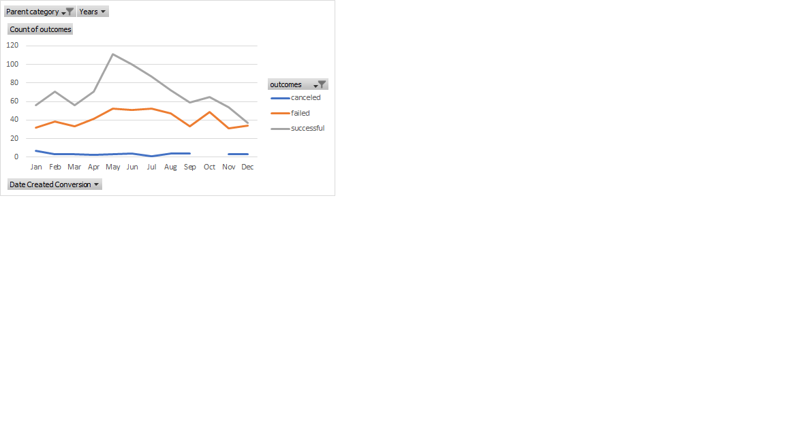
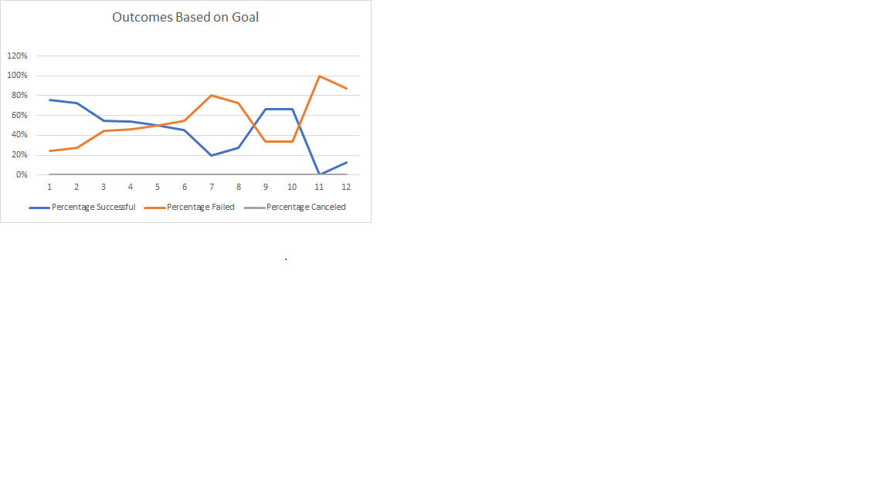

### Hi there 👋

<!--
**lewiclark/lewiclark** is a ✨ _special_ ✨ repository because its `README.md` (this file) appears on your GitHub profile.

Here are some ideas to get you started:

- 🔭 I’m currently working on ...
- 🌱 I’m currently learning ...
- 👯 I’m looking to collaborate on ...
- 🤔 I’m looking for help with ...
- 💬 Ask me about ...
- 📫 How to reach me: ...
- 😄 Pronouns: ...
- ⚡ Fun fact: ...
-->

## Deliverable 1: Outcomes based on launch date chart

## Deliverable 2: Outcomes based on goals chart


## Deliverable 3: A written analysis of the results (README.md)

-The Written analysis for graph one we can see that the outcome succefful rate are most likely happen during spring to summer time, and it will die down at the end of the year, its giving us the indication of when will be the best time of year to preform this activity.

-The outcomes based on goal indicated the less Money/Goal the higher persentage, vice versa.


```
git status
git add
git commit
This site was built using [GitHub Pages](https://pages.github.com/)

- [x] Finish my changes
- [ ] Push my commits to GitHub
- [ ] Open a pull request

Style	Syntax	Keyboard shortcut	Example	Output
Bold	** ** or __ __	command/control + b	**This is bold text**	This is bold text
Italic	* * or _ _	command/control + i	*This text is italicized*	This text is italicized
Strikethrough	~~ ~~		~~This was mistaken text~~	This was mistaken text
Bold and nested italic	** ** and _ _		**This text is _extremely_ important**	This text is extremely important
All bold and italic	*** ***		***All this text is important***	All this text is important

```
- [x] Love Alyssa :shipit:

